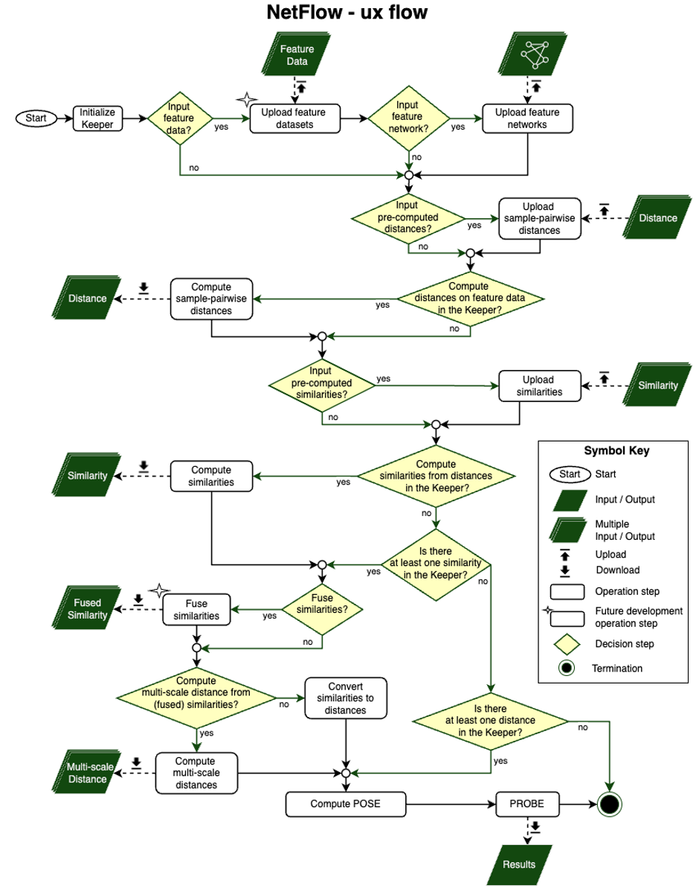

.. _netflow-ug:

******************
netflow User Guide
******************

=================================
Primary netflow analysis workflow
=================================

		   
===========================
The main netflow components
===========================
netflow consists of 3 main components:

#. :py:mod:`netflow.keepers` - This library provides the keeper data structure for loading, storing, analyzing and saving data.
   
#. :py:mod:`netflow.pose` - This library provides tools for computing the POSE. 
   
#. :py:mod:`netflow.probe` - This library provides tools for downstream visualization and analysis of the POSE.

And a few helper components can be found in:

- :py:mod:`netflow.methods`

.. toctree::
   :maxdepth: 1
   :hidden:
   :titlesonly:

   netflow.keepers <../reference/generated/netflow.keepers>
   netflow.pose <../reference/generated/netflow.pose>
   netflow.probe <../reference/generated/netflow.probe>
   netflow.methods <../reference/generated/netflow.methods>

   
   
   
  
