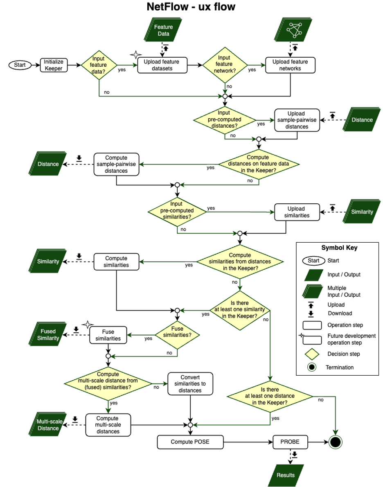

.. _tutorials:

*********
Tutorials
*********

TO DO: UPDATE WITH TUTORIALS

.. grid:: 2

    .. grid-item-card::

        Keeper
	^^^^^^

	This tutorial walks through the Keeper data structure.

        +++

        .. button-ref:: notebooks/keeper_tutorial
            :expand:
            :color: secondary
            :click-parent:

            Keeper tutorial

    .. grid-item-card::

        POSE pipeline - BC
	^^^^^^^^^^^^^^^^^^

	This tutorial walks through the POSE pipeline for a single modality.
	The pipeline is demonstrated on breast cancer (BC) rna data
	from TCGA.

        +++

        .. button-ref:: notebooks/poser_tutorial_BC_rna
            :expand:
            :color: secondary
            :click-parent:

            BC POSE tutorial
	    

    .. grid-item-card::

        POSE pipeline - MM (OLD)
	^^^^^^^^^^^^^^^^^^^^^^^^

	This tutorial walks through the POSE pipeline for a single modality.
	The pipeline is demonstrated on multiple myeloma (MM) rna data
	restricted to the apoptosis pathway.

        +++

        .. button-ref:: notebooks/pose_pipeline_MM_rna_apop
            :expand:
            :color: secondary
            :click-parent:

            MM POSE tutorial

    .. grid-item-card::

        POSE pipeline - BC (OLD)
	^^^^^^^^^^^^^^^^^^^^^^^^

	This tutorial walks through the POSE pipeline for a single modality.
	The pipeline is demonstrated on breast cancer (BC) rna data
	from TCGA.

        +++

        .. button-ref:: notebooks/pose_pipeline_BC_rna
            :expand:
            :color: secondary
            :click-parent:

            BC POSE tutorial
	    

*********************************
Primary netflow analysis workflow
*********************************

	    

